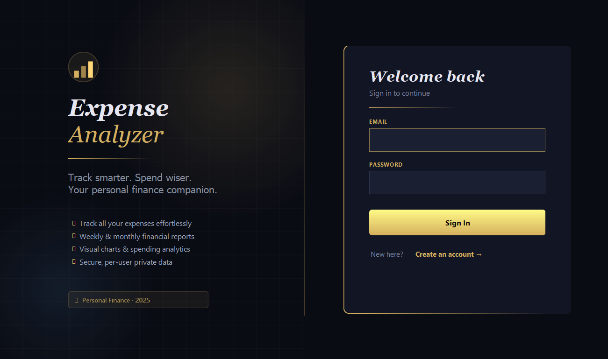
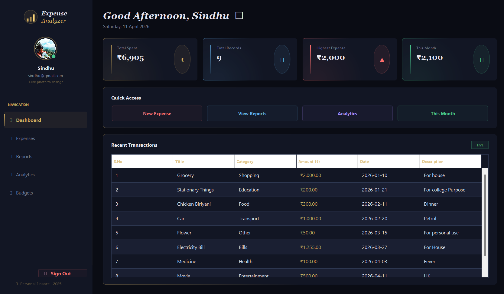

# PERSONAL-EXPENSE-ANALYZER
A Java desktop application to track, manage and analyze personal expenses with secure multi-user authentication, weekly/monthly reports, and visual charts — built with Java Swing, MySQL, and JFreeChart.
# 💰 Personal Expense Analyzer

A full-featured **Java desktop application** for tracking and analyzing personal expenses.
Built with **Java Swing**, **MySQL**, and **JFreeChart** — featuring secure login,
per-user data isolation, weekly/monthly reports, and visual analytics.

---

## 🖥️ Application Preview

> Add screenshots of your app here after uploading

| Login Screen | Dashboard | Analytics |
|---|---|---|
|  |  |  |

---

## ✨ Features

- 🔐 **Secure Authentication** — SHA-256 password hashing with random salt
- 👤 **Multi-user Support** — Each user sees only their own data
- ➕ **Expense Management** — Add, Edit, Delete with auto serial renumbering
- 🏠 **Live Dashboard** — KPI cards (Total Spent, Records, Highest, This Month)
- ⚡ **Quick Access** — One-click navigation from dashboard
- 📋 **Reports Module** — Monthly, Weekly (grouped), and Category reports
- 📈 **Visual Charts** — Category Pie Chart + Monthly Bar Chart (JFreeChart)
- 🌟 **Dark Professional UI** — Clean white theme built with Java Swing

---

## 🛠️ Tech Stack

| Technology | Purpose |
|---|---|
| Java 25 / 26 | Core language |
| Java Swing | Desktop UI framework |
| MySQL 8.x (XAMPP) | Database |
| JDBC (mysql-connector-j 9.6.0) | Database connectivity |
| JFreeChart 1.5.4 | Charts and analytics |
| SHA-256 + SecureRandom | Password security |

---

## 📁 Project Structure
